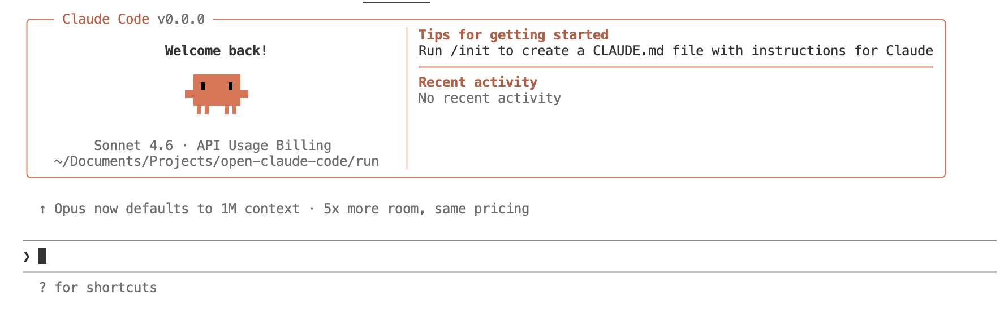

# Open Claude Code
<a href="README-zh.md"></a>
<a href="README.md"></a>
 
## Quickstart
```
cd run
brew install bun
bun install
bun run dev
```



## Directory tree
```
src/
├─ assistant/ — assistant helpers.
├─ bootstrap/ — boot-time setup.
├─ bridge/ — IPC adapters.
├─ buddy/ — buddy features.
├─ cli/ — CLI shell code.
├─ commands/ — named command handlers.
├─ components/ — shared UI pieces.
├─ constants/ — shared constants.
├─ context/ — context stores.
├─ coordinator/ — task coordination.
├─ entrypoints/ — specialized builds.
├─ hooks/ — reusable hooks.
├─ ink/ — terminal UI.
├─ keybindings/ — key mapping rules.
├─ memdir/ — ephemeral storage.
├─ migrations/ — data migrations.
├─ moreright/ — moreright integrations.
├─ native-ts/ — native bindings.
├─ outputStyles/ — CLI styles.
├─ plugins/ — plugin registry.
├─ query/ — query helpers.
├─ remote/ — remote runtime.
├─ schemas/ — config schemas.
├─ screens/ — screen compositions.
├─ server/ — server adapters.
├─ services/ — service backends.
├─ skills/ — skill definitions.
├─ state/ — runtime state.
├─ tasks/ — task runners.
├─ tools/ — tool implementations.
├─ types/ — TypeScript types.
├─ upstreamproxy/ — upstream proxy.
├─ utils/ — utility belt.
├─ vim/ — Vim integration.
├─ voice/ — voice helpers.
├─ commands.ts — CLI registry wiring.
├─ context.ts — context helpers.
├─ cost-tracker.ts — usage tracker.
├─ costHook.ts — cost hooks.
├─ dialogLaunchers.tsx — modal helpers.
├─ history.ts — session history.
├─ ink.ts — Ink initializer.
├─ interactiveHelpers.tsx — prompt helpers.
├─ main.tsx — app bootstrap.
├─ projectOnboardingState.ts — onboarding state.
├─ query.ts — query utilities.
├─ QueryEngine.ts — planning orchestrator.
├─ replLauncher.tsx — REPL entry.
├─ setup.ts — environment prep.
├─ Task.ts — base task API.
├─ tasks.ts — task utilities.
├─ Tool.ts — tool interfaces.
└─ tools.ts — tool helpers.
```

## Entry and bootstrap
- `src/main.tsx` boots the React/Ink UI and ties together the command runner, renderer, and services for the Claude Code experience.
- `src/bootstrap.ts` prepares environment/configuration before the GUI or CLI entrypoints launch, while `src/entrypoints` collects specialized builds such as SDK shells.
- `src/cli` and `src/commands` host the command-line interface, transport adapters, and the hundreds of named commands (e.g., `ctx_viz`, `tasks`, `voice`, `agent`) that users can invoke interactively or via scripts.

## UI and interaction layers
- `src/components` and nested folders (`ui`, `tasks`, `memory`, `teams`, `settings`, `design-system`, etc.) implement the shared React/Ink components, dialogs, and orchestrated screens that compose the experience.
- `src/screens` defines the higher-level pages that compose component combos for onboarding, context views, skills, and other flows.
- `src/hooks`, `src/hooks/notifs`, and `src/hooks/toolPermission` encapsulate reusable logic tied to notifications, tool permissions, and general React state derivation.
- `src/ink` is the Ink-native console UI layer (layouts, components, hooks, events, term I/O) used for terminal-based renderers.
- `src/keybindings` maps keys to recognized commands for both GUI and terminal modes, while `src/context` and `src/state` contain the mutable slices of context the UI consumes.

## Functional subsystems
- `src/tasks`, `src/tasks/*` encode task runners (local shell agents, remote agents, dream tasks, etc.) and provide a pluggable task infrastructure that coordinates tooling, workspaces, and agents.
- `src/tools` (plus `shared`, `testing`, and dozens of named tool implementations like `WebSearchTool`, `FileWriteTool`, `SkillTool`) register the toolkit available to agents, including plan/skill authoring, workspace introspection, and automation helpers.
- `src/services` (e.g., `plugins`, `oauth`, `mcp`, `teamMemorySync`, `PromptSuggestion`) expose long-lived back-end abstractions: API clients, telemetry, plugin orchestration, policy enforcement, and synchronization with upstream systems.
- `src/skills` and `src/plugins` provide the registry/definitions for bundled and third-party intelligence tools that augment the agent’s capabilities.
- `src/query`, `src/QueryEngine.ts`, and `src/queries` (if present) orchestrate the planning/execution engine that dispatches tasks and interprets results.

## Supporting infrastructure
- `src/server` and `src/bridge` house the server-side adapters and the IPC layer used by the CLI, desktop, or web clients to reach the Claude Code core.
- `src/context.ts`, `src/history.ts`, `src/memdir`, and `src/projectOnboardingState.ts` contain persistence/metadata helpers for sessions, memory states, and onboarding progress.
- `src/utils` is a sprawling utility belt (subfolders like `background`, `settings`, `memory`, `mcp`, `permissions`, `telemetry`, `git`, `sandbox`, etc.) that keep the platform cohesive: storage helpers, permission checks, telemetry helpers, sandbox controls, Git helpers, CLI helpers, and more.
- `src/constants`, `src/schemas`, `src/types`, and generated type bundles define shared contracts, configuration schemas, and TypeScript types.

## Native & platform-specific modules
- `src/native-ts` houses TypeScript bindings for native modules (yoga layout, file index, color diff) that the renderer or CLI leverage for formatting and diffing.
- `src/vim` contains Vim integration glue.
- `src/voice`, `src/bridge`, and `src/remote` manage audio/voice helpers, remote bridge connections, and remote runtime orchestration.

## Migrations and background helpers
- `src/migrations` codifies data migrations for storage/backwards compatibility.
- `src/services/autoDream`, `src/services/toolUseSummary`, and `src/services/tips` keep automated features, analytics, and tips in sync with the rest of the system.

## Observability and support macros
- `src/cost-tracker.ts`, `src/costHook.ts`, and `src/monitoring` (if present) track usage costs and integrate with telemetry/analytics.
- `src/remote`, `src/coordinator`, `src/state`, and `src/outputStyles` prepare the shared runtime for remote coordination, CLI output formatting, and shared state machines.

This layout allows the Claude Code runtime to mix React-based UI, Ink terminals, agent commands, threaded tasks, and native extensions while keeping tooling, services, and plugins modular.

## Disclaimer
- All source code contained in this repository is copyrighted by Anthropic.
- This repository is provided solely for technical research, study, and reference purposes. Commercial use is strictly prohibited.
- If any infringement is found, please contact to delete.


